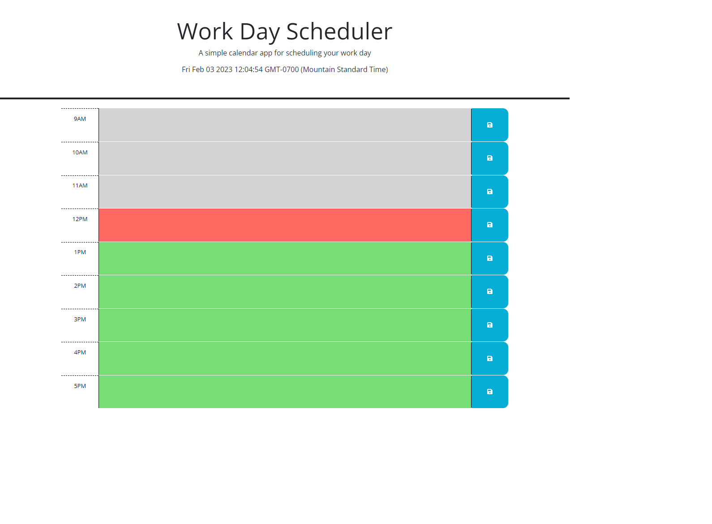

# work-day-scheduler

## **Link to deployed application**
https://jjgavery.github.io/work-day-scheduler

## **Description**  
In this application I was required to make a webpage that had sections for user input to be saved to local storage to schedule tasks in a 9-5 workday. It was required that when a user inputs text into the time blocks and clicks the save button it stores the information into local storage on the users computer and when you refresh the page or when you come back to the page it will retrieve the information and repopulate it into the proper time blocks. Also to help show a deadline for the scheduled tasks it was required to have the time blocks color coded to represent tasks that were handled, tasks that are currently being handled and tasks that are coming up.

## **Technologies**
- HTML
- CSS
- JAVASCRIPT

## **Preview**
    